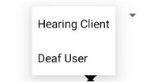
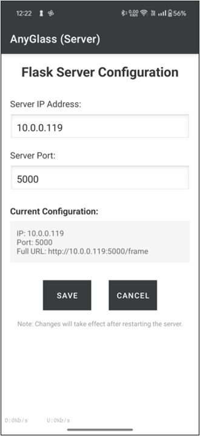
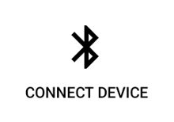
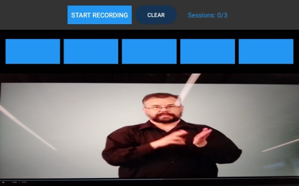
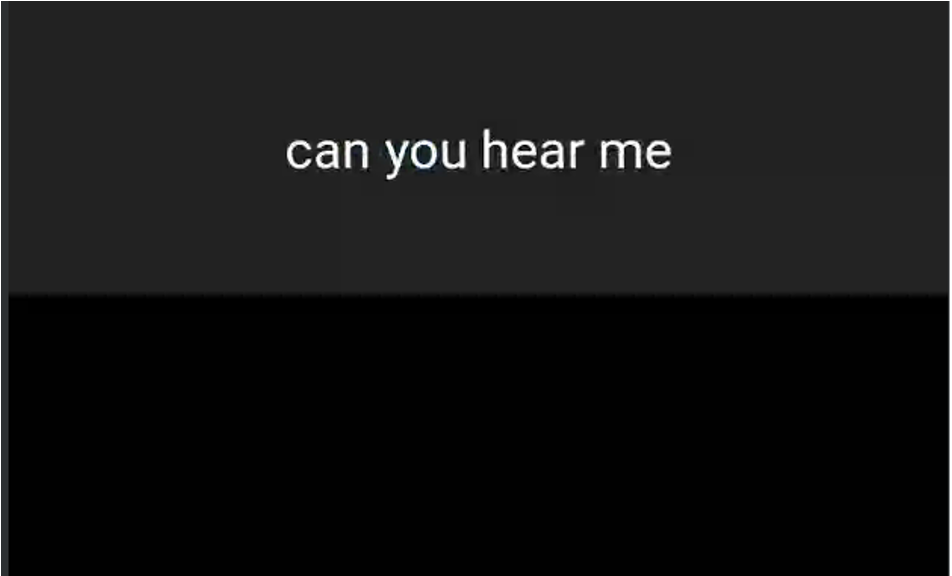

# Getting Started 
Here, we briefly describe how to install and use for the first time. 


### Step 1: Check system requirements before installation

Please first check if you have all the following equipment and APK files. 

- Smart glasses (one pair for working, two pairs recommended)
  | Smart Glasses  (tested)      | INMO Air 2   |
  |--------------|------------------------------------|
  
- Android smartphones (each for one pair of glasses)
   | Phone models (tested) |
   |------------------------|
   | Pixel 5                |
   | OnePlus 13R            |
   | OnePlus 12R            |
   | OnePlus 10 Pro 5G      |
   | Galaxy S23 Ultra|	|
   

- Computers (Windows or Mac OS)
     | Computer models (tested) | OS      | CPU/GPU      | Memory |
     |---------------------------|---------|--------------|--------|
     | MacBook Air 2022          | MacOS   | CPU          | 16GB   |
     | Legion Pro 7i Gen 8       | Windows | RTX 4090 GPU | 32GB   |  
     
  - Download the [Server_Code](https://mssn3.cs.purdue.edu/owncloud/index.php/s/qhMlNkkTFs9gjGL) folder to your local folder. The folder includes:

  	**Server_Code/**
  	- `requirements.txt`  — the requirements for the conda environment  
  	- `anysign-0.3.3-py3-none-any.whl`  — the wheel for installing the anysign package for sign prediction  
  	- **Server/**
    	- `server.py`  — the main Python file for running the server process  
    	- `best_model_appv1.pt`  — the weights for model inference  
    	- other dependent files
  

  - Conda Environment Preparation
  	- Open "requirements.txt"
	- Modify the path of "anysign wheel" to yours in the line "anysign @ file:///path/to/your/anysign-0.3.3-py3-none-any.whl"  in "requirements.txt" #Be careful that you should replace the "/path/.." instead of "path/...".
	- Open "config/test.yaml" file 
	- Modify the path of "best_model_appv1.pt" to yours in the line "weights: /Users/chenpeng/Downloads/TranslationCore/src/main/python/model/best_model_appv1.pt"
	- Run the following commands to prepare the environment
  	> ```bash
  	> conda create -n eS2S python=3.10
  	> conda activate eS2S
  	> pip install -r </path/to/your/Server/requirements.txt>
  	>```
  
  - Start Server Process 
 	- Under your eS2S Conda Environment, run the code to start your server process
  	> ```bash
 	> cd </path/to/your/Server_Code/Server>
	> #check your server's IP address
  	> ifconfig
	> # recommend to use the tested port number 5000
  	> python server.py --host <your_ip_address> --port <port_number>
  	>```

### Step 2: Installation for one pair of glasses and phone

We use GLASS, PHONE, and COMPUTER to represent the devices to be used. 

  
- APK (download from [this Link](https://mssn3.cs.purdue.edu/owncloud/index.php/s/USpvpHcQI20CJQO))

- COMPUTER ADB Setup
	- If you're using Windows, 
		- Follow [Developer Environment Setup](https://www.inmoxr.com/blogs/faqs/how-to-enable-developer-mode-on-inmo-air2?srsltid=AfmBOooQtK8mMnBwbHibvZdLWGSjLsI_6yiXB41DvwZGEocOlHL-gpbo) to set up the GLASS to developer mode and install the APK.
	- If you're using macOS, 
		- Follow [Developer Environment Setup](https://www.inmoxr.com/blogs/faqs/how-to-enable-developer-mode-on-inmo-air2?srsltid=AfmBOooQtK8mMnBwbHibvZdLWGSjLsI_6yiXB41DvwZGEocOlHL-gpbo) to set up the GLASS to developer mode. The steps are also pasted here:
			- Navigate to Settings > About > My Glasses 
			- Long-press the right touchpad for 1.5 seconds on the GLASS twice to access developer mode activation. 
			- Enter the password: 20210108 
		- Install ADB separately using Homebrew: 
			> ```bash
			> brew install android-platform-tools
			>```
		- Connect your GLASS to your COMPUTER via a USB-C cable.
		- Open Terminal on your COMPUTER. Check whether the GLASSES are recognized now by running the command:
			> ```bash
			> adb devices
			> ```
		- If there is a device in the list, use the ADB command to install the APK: 
			> ```bash
			> adb install "/path/to/your/apkfile.apk"
			> ```
- User ADB to install ""
(tethered with GLASS) 	
- Download the **`MASTClient-release.apk`** to your COMPUTER.		
PHONE: select **`MASTServer-release.apk`** to download -> select "Download anyway" -> open with "Package installer".
		
### Step 3: First Use with one pair of glasses

If you install only one pair of smart glasses, we encourage you to run the following test. 
- @GLASS,
	- Go to "settings" and enable the "Bluetooth" on GLASS
	- "Remote Control "Search and connect to the target PHONE in the Bluetooth settings
- @PHONE,
	- Make sure you connect to the WIFI the same as the one on the computer
	- Enter the app installed at step 2
	- Grant all the permissions when you first open the app
		- Open the dropdown spinner 
		- TO test the mode for hearing people, select "Hearing User"
		- TO test the mode for deaf or hard-of-hearing people, select "Signing User" 
	- Click  button and enter the page  
	
	  
	  
	- Enter the IP address and port number set for the server in Step 1
	- Click the "SAVE" button
	- Force quit the app and restart to make the change in effect

- @GLASS, 
	- Enter the apps installed at step 2
	- Grant all the permissions when you first open the app
	
- @PHONE,
	- Select  button and choose the "Connect to Device". 
	- Connect to the target GLASS (e.g., named as "INMO Air2") in the "PAIRED DEVICES"

- @GLASS, 
	- If testing the "hearing user" mode, the screen is like  
	
	  
	  
	  	 - Click the "START RECORDING" button to start your sign recognition
		 - Observe a sign video (e.g., [Video for "Hello" Sign](https://www.signingsavvy.com/sign/hello/4943/3)), to achieve best performance, please follow the tips
		 	- Tip1: Make the signer in the central position
			- Tip2: Make sure the video frame takes all camera view and do not include the extra background environment
			- Tip3: Look straight at the screen, not tilted
		 - Then the top-5 predictions are shown on the five blue boxes in the descending order of confidence level
	- If testing the "signing user" mode, the screen is like  
	
	  
	  
	  	- Speak into the PHONE's microphone and the transcribed English Sentence will be displayed at the top of the screen
	

### Step 4: First Use with two pairs of glasses

Two pairs of glasses are used for two users: one as the "Hearing User" who observes the signing behaviors and another as the "Signing User" who performs the signing behaviors.

	- "Hearing User" follows step 3 to finish the Bluetooth connection, IP settings, and start the apps
	- "Signing User" follows step 3 to finish the Bluetooth connection, and start the apps (not required to do the IP setting)
	- "Hearing User" clicks the "START RECORDING" button and starts to observe the "Signing User"'s singing behaviors
	- "Hearing User" responds to the "Signing User" verbally by speaking into the PHONE's microphone of the "Signing User" 	
	- "Signing User" observes the transcribed English sentence on the GLASS screen and responds using signing behaviors
	- Repeat until the convesation ends
